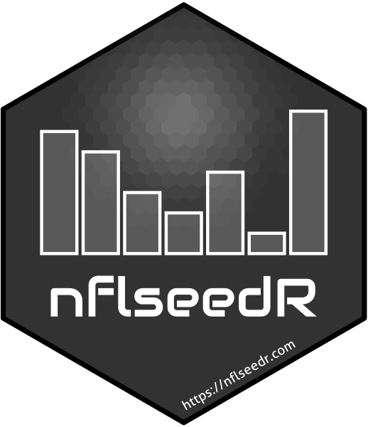

<!-- README.md is generated from README.Rmd. Please edit that file -->

```{r, include = FALSE}
knitr::opts_chunk$set(
  collapse = TRUE,
  comment = "#>",
  fig.path = "man/figures/README-",
  out.width = "100%"
)
```

# **nflseedR** 

<!-- badges: start -->
[](https://CRAN.R-project.org/package=nflseedR)
[](https://CRAN.R-project.org/package=nflseedR)
[](https://nflseedr.com/)
[](https://github.com/nflverse/nflseedR/actions)
[](https://lifecycle.r-lib.org/articles/stages.html#stable)
[](https://discord.com/invite/5Er2FBnnQa)
<!-- badges: end -->

## Motivation

The goal of nflseedR is to allow NFL modelers to simulate NFL seasons using
their models, and taking off their plate the work of tracking the schedule,
navigating the complex rules for  division ranking, playoff seeding, and
draft order. This can also aid in sports betting, such as betting on futures
or win totals.

The package can run thousands of Monte Carlo style simulations of the NFL regular
season, based on a model you input. Within each simulated season, it will calculate
the division standings and playoff seedings for you. It will also the generate the
playoff games and simulate these as well, and calculate the order for next year's
NFL draft. These can be used to examine the probability of team making the playoffs
or winning the Super Bowl, based on your model.

The season simulations will take all completed games into account already, and only
simulate from there forward, including if run during the playoffs. It can also be run
as a fresh season, wiping away results and simulating from scratch.

The season simulation code for nflseedR was developed by Lee Sharpe
([\@LeeSharpeNFL](https://twitter.com/leesharpenfl)) and building it as package was 
developed by Sebastian Carl ([\@mrcaseb](https://twitter.com/mrcaseb)).

## Installation

The easiest way to get nflseedR is to install it from [CRAN](https://cran.r-project.org/package=nflseedR) with:

``` r
install.packages("nflseedR")
```

To get a bug fix or to use a feature from the development version, you can install the development version of nflseedR either from [GitHub](https://github.com/nflverse/nflseedR) with

``` r
if (!require("remotes")) install.packages("remotes")
remotes::install_github("leesharpe/nflseedR")
```

or prebuilt from the [development repo](https://nflverse.r-universe.dev) with:

```{r eval = FALSE}
install.packages("nflseedR", repos = "https://nflverse.r-universe.dev")
```

## Get Started

With nflseedR it's possible to [simulate complete seasons](https://nflseedr.com/articles/articles/nflsim.html) or 
use it's [seeding functions](https://nflseedr.com/articles/articles/nflseedR.html) in custom simulations.
